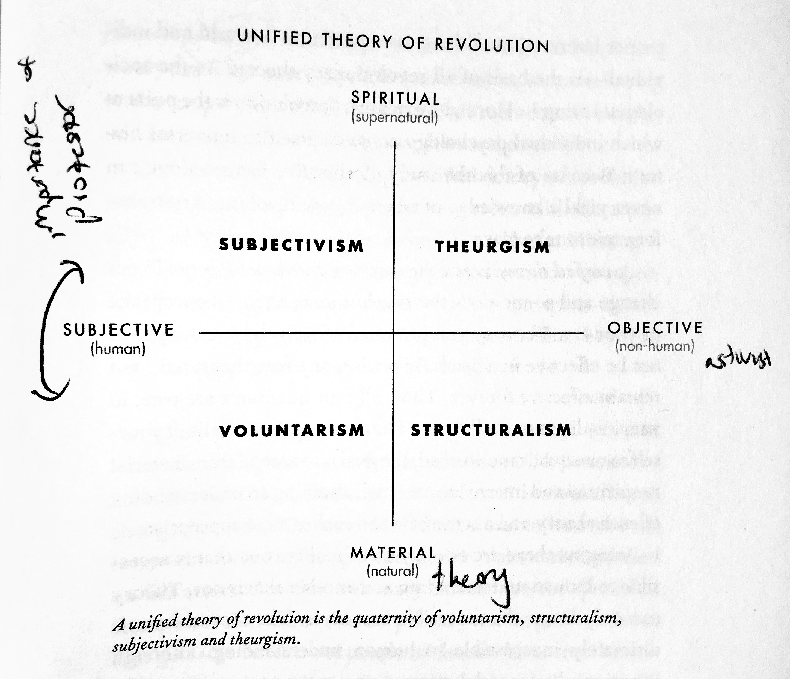
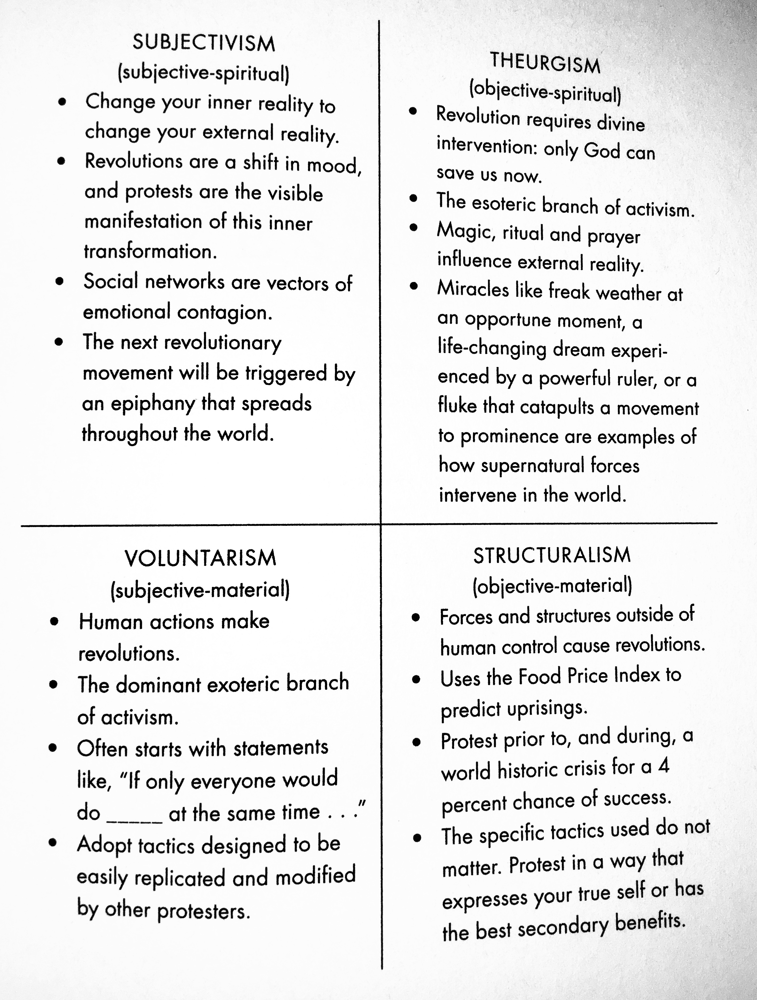

<meta name="twitter:site" content="@josiahparry">
<meta name="twitter:creator" content="@josiahparry">
<meta name="twitter:image" content="http://josiahparry.com/images/favicon.png">
<meta name="twitter:text:title" content="Josiah Parry: Constructing Social Problems">
<meta name="twitter:text:description" content="This book prompts a few questions: (1) what is the goal of a revolution? (2) What is the goal after a successful revolution? (3) How does one conduct an effective protest or revolution?">

# The End of Protest — A Review

I just finished the book [***The End of Protest — A New Playbook for Revolution*** by Micah White](https://endofprotest.com/). I've been nibbling at this book since the spring of 2016. It has provided me with much to think about the political structure and state of the US and the role of the body politic in maintaining an honest democracy.
<!--split-->
In his book, White quickly defines himself as a career contrarian and cofounder of the international Occupy movement. Throughout he draws from lessons he learned from Occupy, his biggest achievement. White begins this book by providing theoretical background of protest and promptly ensures the reader that everything they know about protest may be entirely wrong. He draws upon Occupy to illustrate this point: "we thought that no government could resist the united chorus of its citizens expressing themselves with democratic fervor. That was the meaning of democracy. Not anymore," and implores the reader to become part of the next generation of protestors, which he believes will become successful by "moving beyond critique and toward developing a new paradigm that can replace the old," (p. 36, 42).

The theories of protest and revolution presented by White are subjectivism, theurgist, voluntarism, and structuralism. He uses these theories to frame many of his arguments and serve as the basis of much of the book. They are explained quite well by the following two figures:

This book prompts a few questions: (1) what is the goal of a revolution? (2) What is the goal after a successful revolution? (3) How does one conduct an effective protest or revolution? As this book focuses primarily on democratic protest, and that is what I am interested in, all protests and revolutions I mention will be a theoretical democratic one.

I think it is essential to first define a protest. I found the following quote to be quite succinct: "Protest is, after all, war by other means," (p. 206). This sentence is a summation of an earlier passage which White claims that revolutions and wars are "designed to heal society through abnormal collective action," (p.58). In essence, a protest is any action that is intended to express a sentiment of disapproval and objection to something. Often this "something" is a public policy, or action of the government. Revolution however, is a more extreme protest. It is a protest that deems a current social order to be so damaging to the state of democracy that a new system ought to be instilled. Revolutions can be both violent and non-violent, but what are their goal?

My good friend helped me identify what I believe to be the goal of a revolution through a series of text messages. I sent Harley my typed up collection of quotes and notes from ***The End of Protest*** and asked him what his thoughts were. "Very interesting" he said, and proceeded to quote one of my notes: "If we are always revolting, there will be no peace. This premise is self defeating. The question should no longer be of revolution, but of maintenance and adjustment".

"I fully disagree with this statement," he said. Naturally I asked why.

"Of course we won’t achieve some pure state of 'peace'. The beauty of democracy is the constant state of change. Turbulence and debate is the only means by which a society might hope [to] improve itself, and simply resigning to 'maintenance and adjustment' would halt that process."

"But that’s not what a revolution is, that is what protest is. Revolution is a complete usurpation," I replied. He asked for clarification and from that I have come to the following conclusion about the goal of a revolution. A successful revolution establishes a democratic system that aims to enable humanitarianism and democratic principles, namely liberty and equality. Consequently, I would too argue that once a democratic revolution has succeeded, the goal ought to be the maintenance and furthering of democratic values.

But what of maintaining a democracy? I believe that a healthy democracy should check itself via peaceful protest and a legislature that is reactive to the needs of the body politic. Protest should be met with dialogue and discourse.

White claims that very few books explain *how* to take up a protest, however he offers very little as to how one ought to protest. The largest take away from the book is that protestors should take on the agile method. Protests should be done often, and iteratively, where no two protests are alike. Innovators win. To this I offer a few small tactics.

The first tactic I offer is to protest where the message goes against the grain. This way more people may be truly affected by the sentiments of the protest, and will consequently be spoken of more. Secondly, when protesting, protest in a language that will be understood by your target group. *Phobias* and *-isms* are a bit too abstract. Lastly, and most importantly, have an actionable goal. Protests that offer no solution are just that, a protest. Protests with concrete goals can move mountains.
